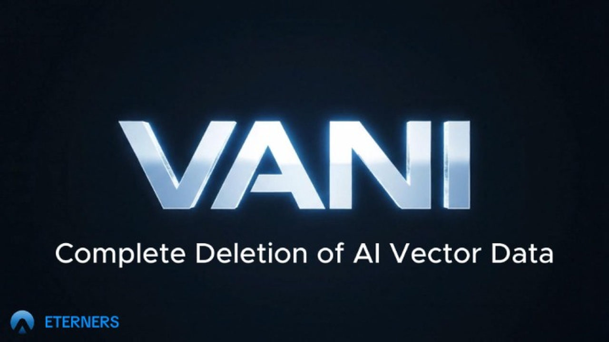
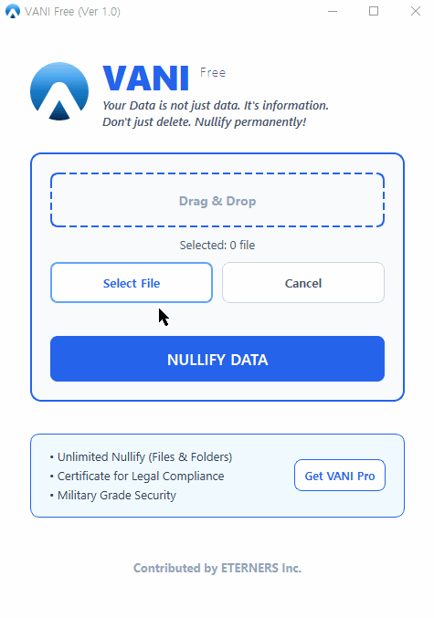

# VANI: Vector Null Data Collapse Engine

 

### **The Entropic Death of Data.**
*Powered by Evolution Hilbert-Orthogonal Engine™*

 

  

 

  

## [📥 Download VANI Free v1.0 (Latest)](https://github.com/eterners-inc/VANI/releases/latest)
**[🔒 Upgrade to VANI Pro ($100)](https://eterners.gumroad.com/l/vani-pro)**

 

[Official Website](http://www.eterners.com) • [Report Bug](https://github.com/eterners-inc/VANI/issues)

---

## 📜 Manifesto: The Era of "Delete" is Over

> **"Your Data is not just files. It is raw material for AI training. Don't just delete. Collapse Meaning."**

In the age of Generative AI and Large Language Models (LLMs), standard data deletion (Zero-fill, DoD 5220.22-M) is becoming obsolete. AI can reconstruct "Magnetic Ghosts" from standard wipes.

**VANI (Vector Annihilation & Nullification Interface)** is the world's first **Vector Data Nullification Solution**. It uses a proprietary Patent-Core engine to create a "Digital Black Hole," collapsing data vectors into absolute NULL.

---

## ⚡ Key Features (v1.0 Patent Engine)

* **🧬 Patent-Core Architecture:** Implements **Gram-Schmidt Orthogonalization** to mathematically break the vector link of file headers.
* **🚀 Flash Collapse Tech:** Wipes **1GB of data in < 1 second** using Rust-based architecture optimized for NVMe/SSD controller caching.
* **🌌 Entropy Injection:** Seed diversification ensures no two deletion patterns are mathematically identical.
* **🖱️ Zero-UI Philosophy:** Simply drag files into the void. No installation required.

---

## 📊 Free vs. Pro Comparison

| Feature | VANI Free | VANI Pro |
| :--- | :---: | :---: |
| **Patent Engine** | **✅ Included** | **✅ Included** |
| **Math Logic** | Gram-Schmidt (Header) | Gram-Schmidt (Header) |
| **Speed** | **NVMe Optimized (1GB < 1s)** | **NVMe Optimized (1GB < 1s)** |
| **Batch Limit** | Single File Mode | **Unlimited (Batch / Folders)** |
| **Algorithm** | Flash Collapse (1-Pass) | **Flash + Military (3-Pass)** |
| **Certificate** | ❌ | **✅ Ghost Protocol™ (HTML)** |
| **Price** | **$0 (Free)** | **[$100 (Lifetime)](https://eterners.gumroad.com/l/vani-pro)** |

> **Note:** VANI Free uses the **exact same forensic engine** as the Pro version. We do not compromise on security for free users. Pro is for professionals needing batch efficiency and audit trails.

---

## 🚀 How to Use

1.  **Download** the latest `VANI_Free.zip` from the [Releases Page](https://github.com/eterners-inc/VANI/releases).
2.  **Unzip** the file.
3.  Run `VANI_Free.exe` (Administrator privileges recommended for system files).
4.  **Drag and drop** a target file into the window.
5.  Watch it vanish into the void.

---

## ⚠️ Disclaimer

**VANI is a permanent data destruction tool.**
Once data is nullified by VANI, it cannot be recovered by any means, including forensic hardware recovery. The developers (ETERNERS Inc.) are not responsible for any accidental data loss. Use with caution.

---

  <small>© 2026 ETERNERS Inc. All Rights Reserved. | Co-evolution of AI and Human</small>

